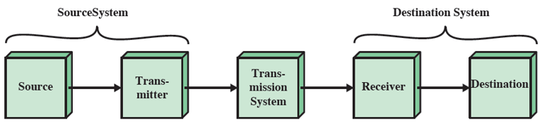
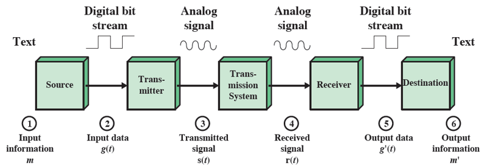

# Data Communications & Data Networking, and the Internet

> 통신의 본질이란, 한 쪽에서 보낸 메시지를 다른 편에서 정확하게 혹은 근사하게 재현해내는 것을 총칭
> 'Calude Shannon'

## Notable Technology Trends : 주목할만한 기술 트렌드
### 더 빠르고 경제적인 커뮤니케이션과 계산
- 더욱 까다로운 application을 지원하는 더욱 강력한 컴퓨터
- 광케이블과 무선의 사용이 증가함에 따라 `전송비용`은 줄어들고 `capacity`는 크게 증가함

### 더욱 "지능화"된 네트워크
- QoS : 각 단계마다 다른 서비스 품질
- 네트워크 관리 및 보안의 다양한 사용자 지정 가능한 서비스

### 인터넷, 웹 및 관련 애플리케이션은 비즈니스 및 개인 네트워크 모두의 주요 기능으로 부상
- 모든 작업 및 기능들이 인터넷으로 취합(**everyting over IP**)

### Mobility(이동성)
- `스마트기기` - 비즈니스 네트워크의 진화
- 기업 application을 모바일 장치에 정기적으로 제공
- `클라우드 컴퓨팅` 도입

## Key Communications Task
- `Transmission system utilization` : 전송 체계 활용도
- `Interfacing` : 표준화
- `Signal generation` : 에러가 가장 적은 신호 생성
- `Synchronization` : 동기화
- `Exchange management` : 교환관리 : 데이터의 송수신 확인
- `Error detection and correction` : 에러 탐지 및 복구
- `Addressing and routing` : 장치 destination 지정 및 라우팅
- `Recovery` : 복구
- `Message formatting` : 모든 정보들의 패키지화(**패킷팅**)
- `Security` : 보안
- `Network management` : 네트워크 관리

## Data Communications Model
### 단순화된 통신 모델

- System : 

### 단순화된 데이터 통신 모델
