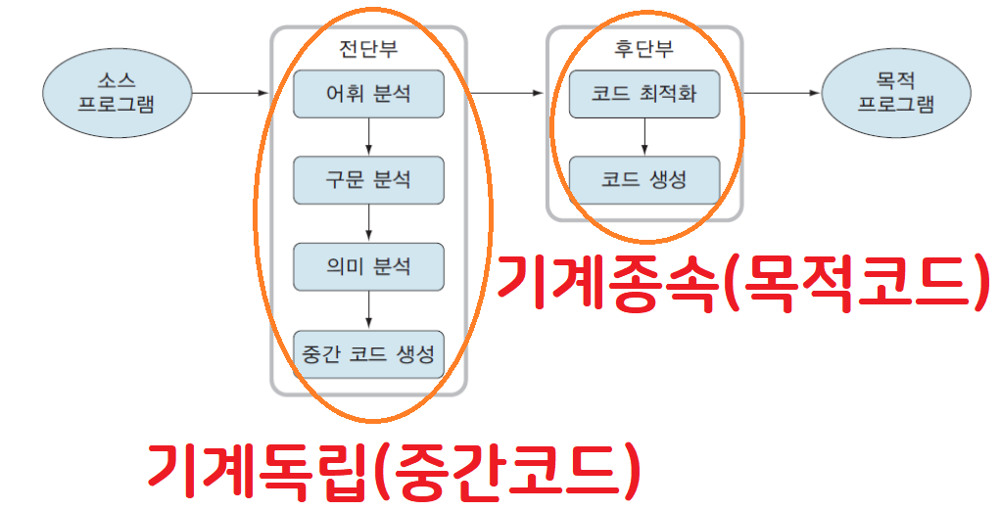
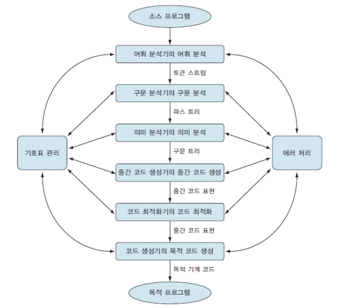
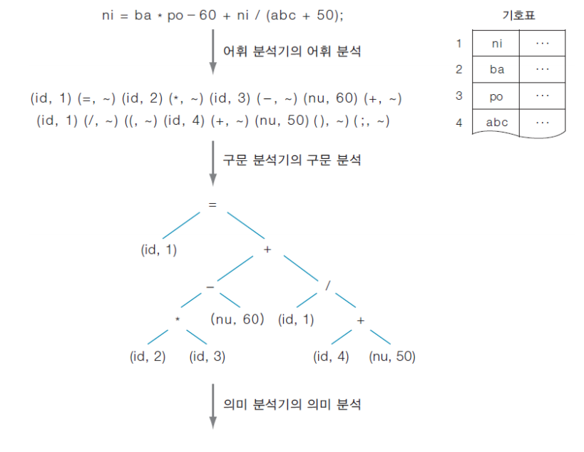
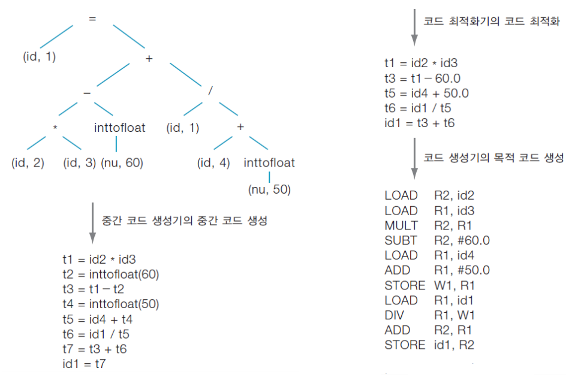
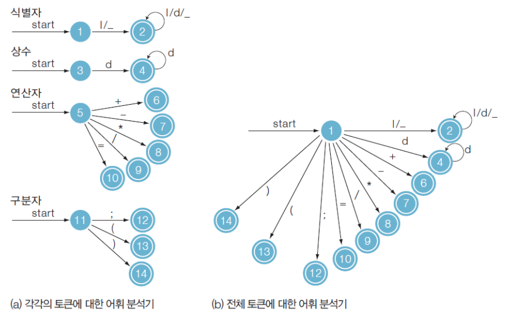
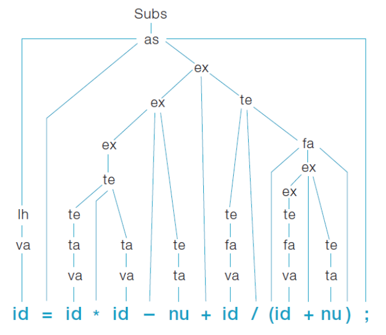
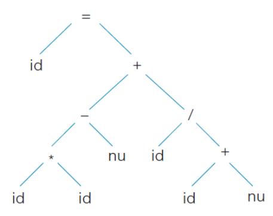
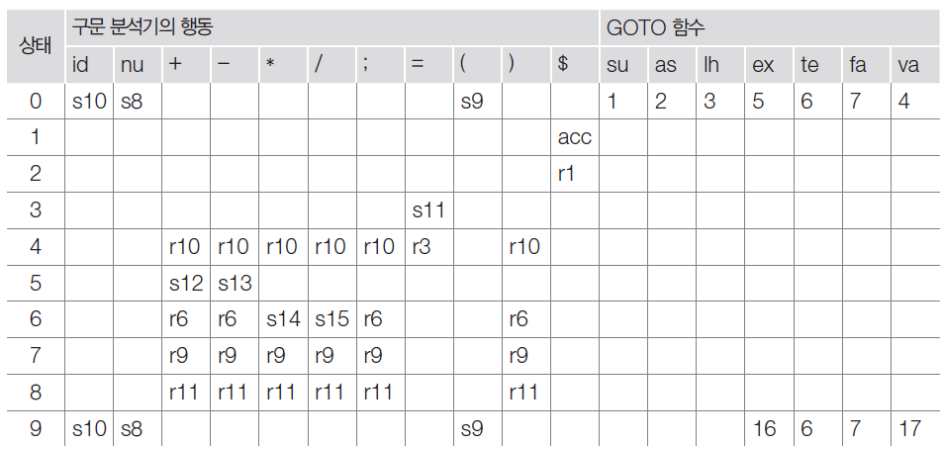
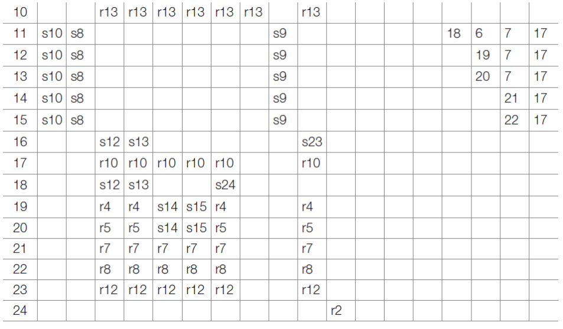

# 간단한 컴파일러의 구조
## 컴파일러의 논리적 구조
### 영어를 한글로 번역
#### 'I am a boy'를 한국어로 번역하는 과정
1. 문장에 사용된 `단어` 검사
2. 영어의 `8품사` 구성 요소 확인
3. 문장 구성의 `5대 요소`로 구분
   - `파싱(parsing)`과 유사
4. 문장 구성 요소 중 어디에 맞는지 확인 **(주어 + 동사 + 보어)**
   - `파스 트리(parse tree)` 생성
5. 한국어 문법에 맞게 번역
   - 중간 코드 → 목적 코드 생성

### 컴파일러의 처리 과정
#### C 언어를 기계어로 번역
`토큰(token)` : C언어에서 사용하는 의미 있는 단어
> *{, }, (, ) 와 같은 괄호 characters*

`어휘 분석` : C언어에서 어떤 토큰이 사용되었는지 구분
`구문 분석` : 토큰들이 문법에 맞는지 검사
> *if, while 과 같은 조건문*

`의미 분석` : 형 type 검사
`코드 최적화` : 의미 분석으로 생성된 코드의 실행 시간 / 기억 장소를 줄임
`목적 코드 생성` : 목적 기계(target machine)의 특성을 고려하여 생성

### 컴파일러의 구조에 대한 견해
`분석 - 합성 모델` : 논리적인 구성 측면
`전단부 - 후단부` : 기계 독립(machine independent) or 기계 종속(dependent), 구현 측면





### 아주 간단한 C 문법
문법에 맞다 = 등호의 양 쪽을 서로 `치환(rewriting)` 가능
```C
// assign-st : assignment - statement
// exp : expression
// (<exp>) : 괄호를 표현
// ident : identifial

1. <Sub C> ::= <assign-st>
2. <assign-st> ::= <lhs> = <exp>;
3. <lhs> ::= <variable>
4. <exp> ::= <exp> + <term> | <exp> = <term> | <term>
5. <term> ::= <term> * <factor> | <term> / <factor> | <factor>
6. <factor> ::= <variable> | <number> | (<exp>)
7. <variable> ::= <ident>
8. <ident> ::= (<letter> | _) {<letter> | <digit>| _ }
9. <number> ::= {<digit>}
10. <letter> ::= a | ... | z
11. <digit> ::= 0 | 1 | ... | 9
```

#### 치환문에 대한 컴파일러 도식화




### 어휘분석(lexical analysis, scanning)
원시 프로그램을 읽어들여 `토큰(token)`리나는 의미 있는 분법적 단위(syntactic entity)로 분리
`토큰(token)` : 문법적으로 의미있는 최소 단위로 문법에서 터미널 기호임
#### 토큰의 종류
`식별자(identifier)` : ( position, initial, rate... )
`예약어(key word)` : ( IF, WHILE, ... ) : reserved
`상수(constant)` : ( 60, "KIM", ... ) : numerical
`연산자(opreator)` : ( +, *, %, ... )
`구분자(delimiter)` : ( [, ], ; ... )

#### 토큰의 유한 오토마타


### 구문분석(syntax-analysis, parsing)
- 어휘분석 단계로부터 토큰들을 전달받음
- 이 토큰들이 주어진 **문법(grammer)** 에 맞는지 검사
- 올바른 문장에 대해서는 그문장에 대한 `파스 트리(parse tree)` 출력
- 올바르지 못한 문장에 대해서는 `에러 메시지(error message)` 출력

`파서(parser)` : 구문분석을 담당하는 도구(tool)
`파스트리(parse tree)` : 토큰들을 터미널 노드(terminal node)로 하는 트리

#### 파스 트리 모형


#### 구문 트리 모형


#### 파싱표



**치환문의 피상 과정을 통해 SLR 파싱표를 얻어낼 수 있음**