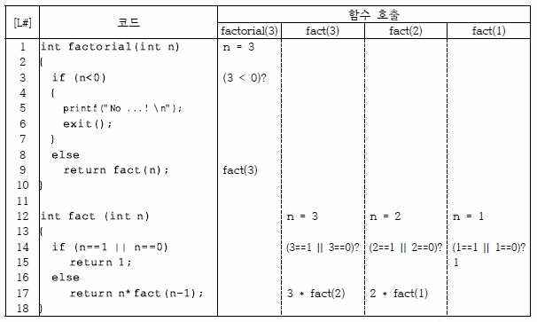
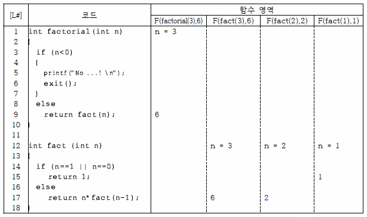

# Ch 01. Principles of Programming Languages(프로그래밍 언어의 원리)
## Contents
### 제 1장 - 프로그래밍 언어의 원리
1. 프로그래밍 언어의 기본적인 쟁점
2. 프로그래밍 언어 정의
3. 프로그래밍 언어의 표현 수준(Level of Expresssion)
   1. ML
   2. Asembly Lang.
   3. High-level Lang.
4. 프로그래밍 언어의 패러다임
5. 결어

### 프로그래밍 언어의 기본적인 쟁점
`프로그래밍 언어(Programming language)` : 컴퓨터를 특정한 목적으로 운용하기 위하여 고안한 지시 언어

`인공언어(artificial) language)` : 자연어와는 다르게 명확한 문법(Syntax)과 의미(semantics)가 정의된 언어

### 분류 및 종류
`절차(Procedural)` : 어떤 일을 진행하는 방법 
`절차중심언어(Procedural Language)` : How에 기반으로 한 프로그램 언어(Pascal, C)
`비절차중심언어(Non-Procedural Language)` : What에 기반으로 한 프로그램 언어(Lisp, Scheme, Prolog, ML)

#### 예제 1 - Factorial 함수 코드
```C
// Prototype : 함수의 이름과 입력/출력을 개략적으로 설명
// body : 중괄호 {}로 묶어진 부분

int factorial(int n) 
{
    int n_f = 1;

    if(n < 0)
    {
        printf("No factorial for negative integer! \n");
        exit(); // unix에서 사용되는 종료 명령어(System call)
    }

    while(n > 0)
    {
        n_f = n_f * n;
        n = n - 1;
    }

    return n_f;
}
```

#### 수업에서의 코드 설명
1. 프로그램에 대한 정의(**의미적 관점에서 설명**)

```C
// Prototype : 함수의 이름과 입력/출력을 개략적으로 설명
// body : 중괄호 {}로 묶어진 부분

int factorial(int n) 
{
    int n_f = 1;

    if(n < 0)
    {
        printf("No factorial for negative integer! \n");
        exit(); // unix에서 사용되는 종료 명령어(System call)
    }

    while(n > 0)
    {
        n_f = n_f * n;
        n = n - 1;
    }

    return n_f;
}
```

2. input에 대한 프로그램의 작동(**실행적 관점에서 설명**)


3. 실행 단계


#### 절차 중심 언어의 특징
어떤 실행문을 실행시킨 후 프로그램의 `상태(State)`가 변경됨
    - 변경되지 않으면 오류가 발생한 것임
    - 
`파괴적 성질(Distructive)` : 프로그램이 실행되고 이전에 있는 상태를 파괴하고 새로운 상태로 변경

`절차 중심 프로그램` : 프로그램 실행 후 절차대로 값들의 변경이 이루어지는 프로그램

#### 예제 2 - 재귀로 짜여진 Factorial 함수 코드
`재귀(Recursion)` : 함수가 자기 자신을 호출하여 반복적으로 실행 
`Inductive case` : 재귀가 이뤄지는 조건
`Base case` : 재귀 함수가 종료되는 조건
   - **Base case가 없다면** 실행 데이터를 저장하는 Stack이 한도까지 쌓이기 때문에 OS가 강제적으로 프로그램을 중지시킴

##### Code
```C
int factorial(int n)
{
    if (n < 0) 
    {
        // 음수에 대한 처리
        printf("No factorial for negative integer! \n");
        exit();
    }
    else
        return fact (n);
}

int fact (int n)
{
    // Set the base case
    if (n == 1 || n == 0)
        return 1;
    else
        return n * fact(n - 1);
}
```
##### 실행과정


##### 재귀함수 영역(Domain - 치역)
`Range` : 표적
`Domain` : 타겟 - OUTPUT
`함수언어 프로그램` : 함수들의 연계성에 따라 입력에 대한 출력을 얻기 위해 프로시저가 병렬적으로 수행되는 프로그램
- 절차 중심 프로그램의 상태(State)는 각 단계의 값의 의미가 모호하지만, 함수 언어 프로그램은 각각의 단계가 의미적 entity가 있음



---

### 시/공간복잡도(Time Space Complexity)
연산 성능과 공간 활용도는 `복잡도(Complexity)` 관점에서 정의하고 분석

`시간복잡도(time complexity)` : 연산 성능을 규정하는 복잡도
`공간복잡도(space complexity)` : 공간 활용도를 규정하는 복잡도

#### Algorithm과 Data의 관계
`Algorithm` : 프로그램을 수행할 때 얼마나 반복적이고 복잡한 단계를 거치는가?
`Data` : 프로그램을 수행할 때 얼마나 큰 space가 필요한가?

#### Time Complexity : Search Algorithm
|Time Complexity|method|State|
|:--:|:--:|:--:|
|**O(n)**|Search() Algorithm : Linear - Array[1...n]|**Unordered**|
|**O(lon(n))**|Search() Algorithm : Binary - Binary Tree(n)|**Full**|
|**O(log(n))**|Search() Algorithm : Binary - Array[1...n]|**Ordered**|

#### Factorial로 비교하는 절차중심 함수 vs 재귀중심 함수
||절차중심 함수|재귀중심 함수|
|:--:|:--:|:--:|
|Time Complexity|O(n)|O(n)|
|Space Complexity|O(n)|**O(1)**|

- Space Complexity 관점에서 절차중심 함수가 더 좋아보일 수 있으나, 단계적으로 분석할 때 재귀중심 함수가 더 의미가 있으므로 함수언어 프로그램이 더 고등함

---

### Factorial: 비절차중심언어(Logic) - Prolog
```Prolog
/* 곱셈(mult)를 정의하는 함수 */
/* mult 0 y 0 ----> 0 * y = 0 */
(infer (mult 0 y 0)) 
(infer (mult X Y Z) from
                        (minus X 1 V) 
                        (mult V Y W)
                        (plus W Y Z))
(infer (fact 0 1))
(infer (fact 1 1))
(infer (fact n x) from
                    (minus n 1 m)
                    (fact m y)
                    (mult n y x))
(infer? (fact 3 x) (print x))
```

```Prolog
(infer (mult 0 y 0))
(infer (mult X Y Z) from
                        (minus X 1 V)
                        (mult V Y W)
                        (plus W Y Z))
(infer (fact 0 1))
(infer (fact 1 1))
(infer (fact n x) from
                    (minus n 1 m)
                    (fact m y)
                    (mult n y x))
(infer? (fact 3 x) (print x))
```

1. 귀납법을 사용하여 Recursive하게 만들어짐(inductive definition)
2. Relation을 규정한 조건을 만족하는 input과 output의 관계만으로 정의
    - 추상화 정도가 매우 높음(절차중심처럼 단계마다 값을 지정할 필요 없음)

#### Prolog로 작성된 Factorial의 실행


---

### 프로그램 실행 체계 및 방법


