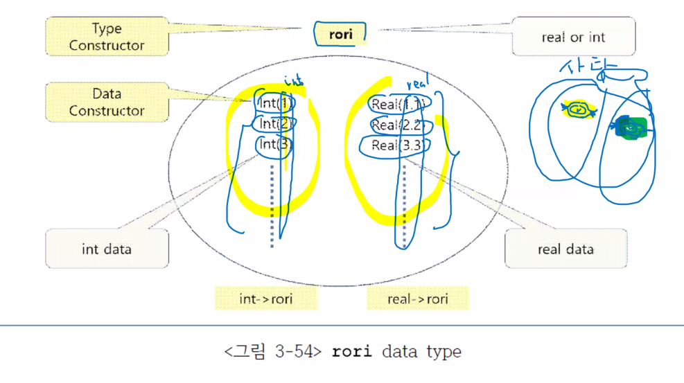
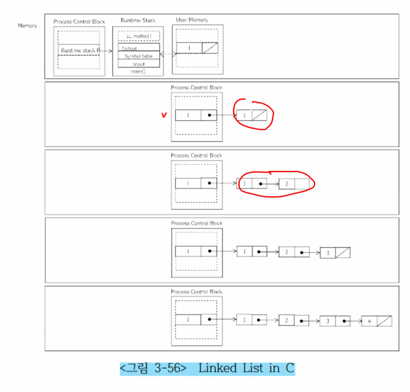

기존의 각각의 PL에서 제공해주는 basic type(int, real string)을 사용하는데, 각가에 해당하는 유형이 이미 결정이 되어 있음 -> 상식적인 내용임

우리가 만약에 새로운 유형을 정의하려고 한다면
-> 동일한 형식을 갖추어야 함
-> 특정한 새로운 유형은 어떤 값을 가지고 있는게 이 값을 규정해야 함

ex) buildingMatrials라는 새로운 유형을 정의하려면
우리가 여기에 필요한 값들을 정의해 정의해야 함

	buildingMaterials{Straw, Wood, Brick};

Data type structure를 construction(구축)하는 방법을 알아야 함

```ML
datatype buildingMaterials = 
	Straw | Wood | Brick;
datatype buildingMaertials
	con Straw
	con Wood
	con Brick
```

```ML
fun isBrick (x) = (x=Brick); 	// x가 Brick인지 확인
val isBrick = fn : buildingMaterials -> bool
```


### `elt Set Example
#### 집합에 대한 datatype 정의
```ML
datatype `elt Set
    Union of `elt Set * `elt Set |
    Intel of `elt Set * `elt Set |
    Op of `elt list;

datatype `a Set
    con Inter : `a Set * `a Set -> `a Set
    con Op : `a list -> `a Set
    con Union : `a Set * `a Set -> `a Set
```

```txt
{1,2,3} ∩ {2,3,4} ∩ {4,5,6}
```

```ML
val set1 = Union(Op([1,2,3]),
                    Inter (Op([2,3,4]),
                            OP([4,5,6])));
val set1 = Union (Op [1,2,3], Inter (Op #, Op #302))) : int Set
// # : 긴 내용을 다 표현할 수 없기 때문에 사용하는 숨김 표시
```

### List 정의
### C에서의 LIst 정의의 단점

데이터 구조를 정의하는 모든 일련의 과정을 스스로 만들어야 하며 그 때에 발생하는 오류들을 개발자 본인이 책임져야 함
하지만 ML은 기본 제공되는 형식으로 처리를 해줌

### 형식 매개변수의 대입(eager evaluation)
f()에 대하여 num 및 value만 parameter로 대입할 수 있음

#### value간의 연산 형식으로 입력(capacity, capability)
value + value의 result가 아닌 "value + value" 그 자체로 parameter로 대입하려고 할 때, 기본형과 Union과 Intersection을 하나의 형식 매개변수에 맞는 실질 매개변수로 입력할 수 있음

#### member Example
```ML
fun member(x, Op(nil) = false
    | member(x, Op(y::ys)) = 
        if x = y then true
            else member(x, Op(ys))
    | member(x, Union(s, t)) =
        member(x, s) orelse member(x, t)
    | member(x, Inter(s, t)) =
        member(x, s) andalse member(x, t);

val member = fn : "a* "a Set -> bool
```

```txt
m(2, [1,2,3]) ? ------> 2, 1::[2,3]         // 같을때까지 head와 tail 비교
                                2, 2::[3]
                                    true;
```

형식 매개변수 내에서 형식 매개변수를 선택 가능(if, else로 일일이 정의해주지 않아도 됨)

## socket problem
앞의 조건이 참이어서 뒤의 조건을 판별할 필요가 없다고 판단 -> 데드락, crash가 일어날 수 있음

#### binary tree(Btree) example
```ML
Datatype `label Btree = 
    Empty |
    Node of `label
            * `label Btree
            * `label Btree;

datatype `a BTree
    con Empty : `a Btree
    con NOde : `a * `a Btree * `a Btree -> `a Btree
```

##### ML에서의 간소화
C에서 recursive하게 정의된 Btree의 빈 left, right를 `Empty`라는 Datatype으로 정의
Node = ``label
left, right = * ``label Btree;

