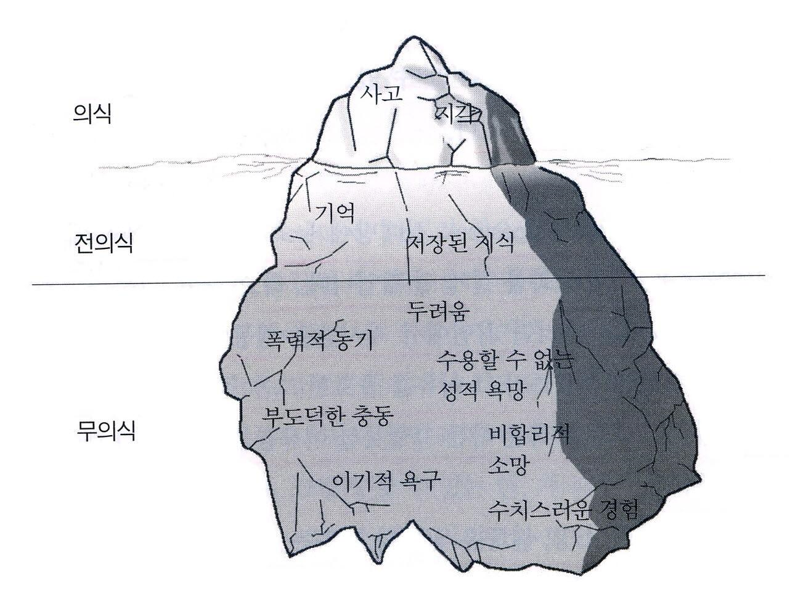
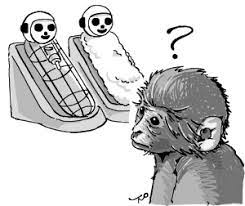

# 심리학의 본질과 연구 방법
## 심리학이란 무엇인가
### 오해
- `독심술`
- `혈액형별 성격` : 한 두 가지의 특징(ex. 혈액형)을 기반으로 사람을 추론
- `물리학` : 시간이나 공간이 달라도 통용 가능성이 높고 연구 대상 관찰 가능
- `심리학` : **성별, 연령, 상황** 등에 따른 변화 가능성이 높아 **연구 대상의 관찰이 어려움**

## 과학으로서의 심리학
### 심리학
상식적인 내용을 공유하기 보다는 과학적인 방법을 사용
물리학, 화학, 생물학 등과 같이 **과학적인 목표를 추구**

### 과학적 방법
문제를 분석하고 해결하기 위해 실증적인 증거를 이용하는 일련의 단계들을 구성
(관찰, 자료수집, 결론에 이르기까지 **객관적 방법 사용**)

## 심리학의 정의와 목적
### 정의
인간과 동물의 행동 및 그 행동에 관련된 **생리적 / 심리적 / 사회적** (정신) 과정을 연구하는 학문 분야
`행동` : 신체 움직임(**외적**), 두뇌 행동(**내적**), 정상적 / 비정상적 행동

### 목적
- 발생한 어떤 행동이나 정신 과정의 내용을 객관적으로 **기술**
- 그와 같은 행동이나 정신 과정이 발생한 이유 **탐색 및 설명**
- 조건이나 상황의 변화에 따른 발생 여부를 **예측**
- 그와 같은 행동이나 정신과정의 **통제 방법**을 기술
- 바람직하지 못한 행동 or 정신괒어에 대한 **변화** 또는 **수정** 여부 기술
- **인간의 삶의 질 향상에 기여**

## 현대 심리학의 역사
고대 그리스 철학 : **심신일원론** vs. **심신이원론**

Fenchner(1800년대 중반) - 정신물리학의 기초 : 현대 심리학의 시발점
1. 구성주의 심리학
2. 기능주의 심리학
3. 형태주의 심리학
4. 행동주의 심리학
5. 인지주의 심리학

### 구성주의 심리학
#### Wundt(1932-1920)
마음의 기본 요소 중심 / 의식경험의 구성요소
- 의식은 **객관적 감각요소(ex. 시각, 청각)** 와 **주관적 느낌요소(ex. 감정, 의지)** 로 분해해서 분석이 가능하다고 주장
- **분석적 내성법**

### 형태주의 심리학
#### Wertheimer, Koffka, & Kohler
마음이나 의식은 잘 조직화된 **하나의 전체**로 이해
구성주의에 대한 반발

**의식 경험의 전체는 부분의 합보다 크다고 주장**
- ex) 노파 or 고개 돌린 여인으로 보이는 그림

#### Kanizsa Triangle

삼각형이 없어도 존재한다고 생각해버림
불완전한 형태를 완전한 형태로 지각하려는 경향

### 기능주의 심리학
#### James(1842 - 1910)
의식은 요소로 나뉠 수 없는 상태
**의식 사용**이나 **기능**을 강조
- 내성법이 불가능한 대상(어린아이, 정신 장애인, 동물)
  > 내성법 : 가만히 자신의 마음을 객관적으로 들여다 보는 방법

- 인간의 의식 내용보다 **심리적 기능**에 초점
- 인류의 생존을 증진시키기에 의식적 정신은 진화함
- 의식적 정신 : 현재 상황을 평가하여 **최적의 행동을 선택**

**심리학 실험 대상을 동물, 아이 및 정신 장애인으로 확대**
**기억, 사고, 성격과 같은 주제들을 심리학의 주요 문제로 포함**

### 행동주의 심리학
#### Watson (1878 - 1950)
**관찰** 가능한 행동이나 **추정** 가능한 사건을 연구
눈에 보이지 않는 정신 과정을 **배제**

뇌의 정신 과정을 블랙박스로 규정 - 이 과정은 연구에서 배제
외부에서 온 자극에 의한 반응(Response)만 체크

#### 강화 & 처벌
반응에 이어 주어지는 자극에 따라 그 반응빈도 증감
(ex. 칭찬은 고래도 춤추게 한다)

### 인지주의 심리학
#### Kohler & Tolman(1886 - 1959)

'insight learning' & 'cognitive map'
인간이기에 생각하고, 생각하기에 행동한다

---

## 심리학의 주요 관점
### 정신분석적 접근
`프로이트` : 무의식적 성적 / 공격적 충동의 역할 중시
`후기` : 의식적 선택 및 자기주도(self-direction) 중시

ex) 흡연 : 무의식적 갈등의 상징
응석 부리는 어린이로 있고 싶은 바람과 독립적인 성인이 되고 싶은 바람 사이의 갈등

### 생물학적 접근
- 두뇌에서의 사건(뇌세포의 활동)과 정신 과정간의 연결 과정 탐색
- SCAN, PET, fMRI 등의 기기를 활용(생리심리학 & 신경과학)

### 인본주의적 접근
`의식과 자기 인식(self - awareness)`
- 행동의 선택권은 우리에게 있는가?
- 인간은 선천적으로 선한 의지와 선택 능력이 있는 능동적인 창조물
- 자신이 잠재력을 개발하고 성장을 위해 부단히 노력하는 것이 중요
- 사람들이 자각을 통해 자신의 잠재력을 실현하도록 도와주는 방법을 연구

`우리 자신을 제작`
세상은 호의적이다(행복감) vs 적대적이다(불안)
- 기준이 어디냐에 따라 그 사람의 삶이 달라질 수 있음
- 
현상학적 심리학 & 실존주의 심리학

ex) 흡연 : 이익으로 지각 vs 위험으로 지각
스스로 결심하지 않는 한 외부의 노력은 실패

### 행동적 접근
**관찰 가능한 행동만을 연구**
'학습을 통해 무엇을 알게 되었는가'가 아닌 '**무엇이 그렇게 하도록 조건화 했는가**'를 연구

ex) 흡연
- 어릴 때 주위에서 존경받는 어른들의 흡연 관찰
- 좋아하는 배우가 흡연하는 영화 장면을 보면서 성장
- 흡연이 존경이나 멋진 것과 연결되는 조건화 과정을 학습
- 호의적은 태도 형성

### 인지적 접근
**정신과정을 연구**
인간의 두뇌가 정보를 받아들여 처리하고 특정 행동 유형을 만들어 내는 방법을 연구
`인지발달이론` : Jean Piaget, 1896~1980
`정보처리이론` : 컴퓨터 과학의 영향 - 사람 또한 컴퓨터처럼 입력 / 저장 / 출력의 과정을 거침

ex) 흡연
- 흡연으로 인한 위험을 인지적으로 **저평가**
- 중요한 정보처리에 대한 **미흡한 조직화**

### 심리학의 5대 관점의 비교
|관점|개념적 초점|인간본성에 대한 견해|정신과정의 강조|'환경/인간'의 강조|
|:--:|:--:|:--:|:--:|:--:|
|**생물학적**|행동의 기초는 생물학적 기능이다|중립적|중간|인간|
|**인지적**|사고과정 및 세상에 대한 이해|중립적|**최대**|인간 및 환경|
|**행동적**|관찰 가능한 행동|중립적|**최소**|**환경**|
|**정신분석적**|무의식적 요인들|**부정적**|**최대(무의식 강조)**|인간|
|**인본주의적**|잠재력을 실현하기 위한 인간의 욕망|**긍정적**|**최대**|인간|

## 심리학의 연구방법
### 연구방법
- 연구자가 오류와 편향을 최소화
- 자신의 연구 주제에 대한 답을 찾기 위해서 
- 자료를 수집하는 절차 or 기법

#### 기술 연구방법
- 연구자가 관심을 가진 주제나 현상의 현 상황이나 상태를 파악
- 체계적으로 기술하고 요약하고자 할 때 사용

##### 조사법
특정 대상에 대한 태도, 신념, 의견 또는 의향을 `설문지나 면접`을 이용해 수집하는 연구 방법
> ex) 성적 반응에 대한 연구와 같은 개인 정보

- 장점 : 비교적 **짦은 시간** 내에 **적은 비용**으로 많은 자료 수집 가능
- 단점 : 전체 집단을 대표하지 못하거나 정직하게 답하지 않은 경우(**자료의 대표성 및 신뢰성 문제**)

##### 관찰법
연구 초기 단계에 적절

연구 주제나 현상을 과학적으로 분석하기 위해 일상적 환경에서 생활하는 사람들의 행동을 **체계적으로 관찰**하고 그 **내용을 요약**하는 연구 방법

- 장점 : `관찰 변수`에 대한 체계적이고 세심한 측정 가능
- 단점 : 관찰자의 **편견이나 희망 등이 투사**될 수 있는 한계

##### 사례 연구법
특정 개인, 집단 또는 상황에 관련 발생 현상에 집중해서 심도 깊은 자료를 수집

연구자의 관심 현상이 **매우 복잡하거나 희귀한 경우**
> ex) 
> 임상심리학 관련 분야
> 프로이트가 면접한 신경증 환자

- 단점
  - 소수의 사례가 전체 집단을 대표하지 못함
  - 한 사례에서 발견한 행동의 원인이 다른 모든 사례에 적용된다는 보장이 없음

#### 상관 연구방법
연구자가 추세를 분석하거나 자신의 연구 가설을 검증하거나 다른 연구자의 이론을 평가하기 위해서 **두 개 이상의 현상(또는 변인)사이의 관련성**을 알고자 할 때 사용

- 장점 : 두 개 이상의 현상 사이의 관련성을 확인

- 단점 : **인과성(한 현상이 다른 현상의 원인)**을 주장하기는 어려움

##### 상관계수
두 개의 변인이 관련되어 있는 정도의 추정치

`정적상관` : 뇌 부위의 손상 정도와 얼굴재인의 오류율(%) = **상호 증가** = 1차원 그래프 증가곡선
`부적상관` : 뇌 부위의 손상 정도와 얼굴재인의 정확율(%) = **상호 역설** = 1차원 그래프 감소곡선
`제로상관` : 환자의 신장과 얼굴재인의 오류율(%) = **상호 무관** = 1차원 그래프의 증감과 관계 없이 나타나는 표본

#### 인과성 연구방법
두 개 이상의 현상 사이의 인과성을 알아보는 방법

##### 실험
원인과 결과에 대한 가설을 검증하는 강력한 수단
실험실에서 면밀하게 **조건을 통제**하고 **변인들 사이의 인과 관계를 찾기** 위한 측정을 실시

`무선 배정` : 실험 참여자를 무작위로 실험 조건에 배정
`이중부지(double - blind)` : 실험 진행자와 실험 참여자 모두 실험 목적을 모름

##### 측정
`statistically significant` : 통계적 검증 결과, 우연에 의한 차이가 아님)
> 사랑의 발견(천 엄마 vs 철사 엄마)
> 
> 우유를 먹은 후 따뜻함을 느낄 수 있는 천 엄마에게서 떨어지지 않음
> 이 실험을 여러 번 반복하여 정규분포 그래프를 취함
> 그래프 양 쪽 끝의 결과 : 조작에 의한 결과로 판단

#### 양적 연구방법
실증주의 철학에 기반
가치 중립적 입장에서 **연역적 접근방법**을 이용하여 연구 결론을 도출
> 이론 설정 : 자료를 통해 이론을 검증

`자료 수집 방법` : 실험과 조사법

**수집된 자료의 수량화를 통해 통계분석 실시**

#### 질적 연구방법
자연주의, 구성주의, 상대주의 철학에 뿌리
연구자 자신과 연구 대상자가 서로 상호작용하는 존재임을 인식
**귀납적 접근방법**을 이용해서 연구 결론 도출
> 자료 수집 → 수집된 자료를 바탕으로 이론 도출

자료 수집 : `관찰법`과 `사례연구법` 이용
수집된 자료를 대상으로 **내용분석 실시** or **현상학적으로 해석**

### 심리학 연구의 윤리
인간을 대상으로 한 연구
최소위험성, 사전동의, 해명

`동물연구` : 동물 행동 그 자체에 대한 연구
동물 시스템이 **인간 시스템의 모델을 제공**할 수 있는 경우