# 생리심리학
## 생명의 진화
지금으로부터 35억년 전 쯤, 지구상에 최초의 생명이 탄생

(복제능력)복사분자 → 단세포 무핵박테리아 → (광합성)무핵박테리아 → 유핵단세포생물 → 다세포 생명체 → 척추 동물 → 물고기 → 양서류 → 파충류 → 포유류 · 조류

최초의 인간이 탄생한 것은 300만 년 전 쯤으로 추정

#### 진화된 다세포 생명체의 세포
각기 다른 여러 종류의 세포를 만들 수 있는 다량의 `유전정보(DNA)`를 핵 속에 지님

#### 인간의 수정란
하나의 세포지만 엄청나게 많은 `유전정보(DNA)`를 지님
자궁 속에서 수 없이 세포 분열

단세포 → 다세포, 무척추동물 → 척추동물, 물고기 → 인간에 이르는 기나긴 진화의 역사를 280일 정도의 기간에 재연

## 인체의 시스템
#### 조직 tissue
동일한 종류의 세포들로 이루어진 기능적 단위
> 근육조직, 피부조직, 신경조직 등

#### 기관 organ
몇 가지 조직이 특정 기능을 수행하기 위해 구성
> 심장, 간 및 뇌 등

### 계 system
특정기관과 부속기관이 특정한 생리적 기능을 수행하기 위해 구성

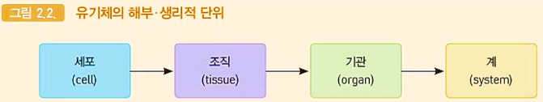

### 인체 구성 세포들
생존과 생식을 위해 필요한 다양한 기능을 나누어 수행(**분업방식**)

#### 골격계
신체의 지주 및 근육으로 수동적 운동기관 역할
중요 장기를 보호해주고 골수에서 혈구를 생산

#### 근육계
근육수축을 통해 신체를 움직이고, 심장과 내장의 운동을 일으킴

#### 감각계
눈 · 귀 · 코 · 혀 · 피부 · 내장기관 등에 분포하는 감각세포를 통해 신체 내 · 외부자극을 감지하여 신경계로 보냄

### 에너지 생산
세포내에서 산소와 포도당을 결합시켜 생물학적 에너지인 `ATP`를 만드는 과정

#### 호흡기계
에너지 생산에 필요한 산소를 받아들임
에너지대사의 노폐물인 이산화탄소를 대기 중으로 보냄

#### 소화기계
음식물을 물리적으로 분쇄하고 화학적으로 분해햐여 세포 속으로 들어갈 수 있는 포도당 · 아미노산 같은 작은 단위로 만드는 기능 수행

#### 순환기계
심장 · 동맥 · 모세혈관 · 정맥으로 구성되는 물질수송체계
호흡기계의 산소와 소화기계의 영양물질을 모든 세포 하나하나에 배달
세포가 배설하는 이산화탄소를 호흡기계로 기타 노폐물질을 간 · 콩팥 등으로 보냄

#### 비뇨기계
노폐물을 신체 밖으로 배설하는 기능 담당

#### 생식기계
남성에서는 고환과 음경
여성에서는 난소 · 자궁 · 질 등으로 구성
생식과정을 통해 후손을 만들어내는 역할 수행

## 신경계의 진화
<table style="margin-left:auto;margin-right:auto;text-align:center;">
  <tr>
    <td>신경계</td>
    <td>내분비계</td>
  </tr>
  <tr>
    <td colspan="2">인체의 모든 기능을 통합 · 조절하는 기능을 수행하기 위해</td>
  </tr>
  <tr>
    <td text-align:center>내분비계보다 발전된 형태 신호 전달 방식이 매우 특징적인 정교한 통제를 통하여 기능을 수행  최고 중추는 '뇌' brain</td>
    <td>진화과정에서 먼저 나타남 동질정체와 같은 포괄적 조절 기능</td>
  </tr>
</table>

### 달리기
#### 신경계
- 근육으로 신경신호를 보내 다리 운동에 필요한 근육수축을 조절
- 에너지 생산에 필요한 산소를 위한 호흡 증가 유도
- 심장박동과 혈압 상승을 통해 골격근세포와 뇌에 더 많은 산소와 포도당 공급을 조절
- 감각기관으로부터 정보를 입력받아 넘어지지 않고 똑바로 달릴 수 있도록 근육수축을 조정

#### 내분비계
- 혈류로의 호르몬 방출을 통해 신진대사 증가
- 높은 각성을 유발하고 유지하도록 조절

## 신경계
### 신경계의 구조
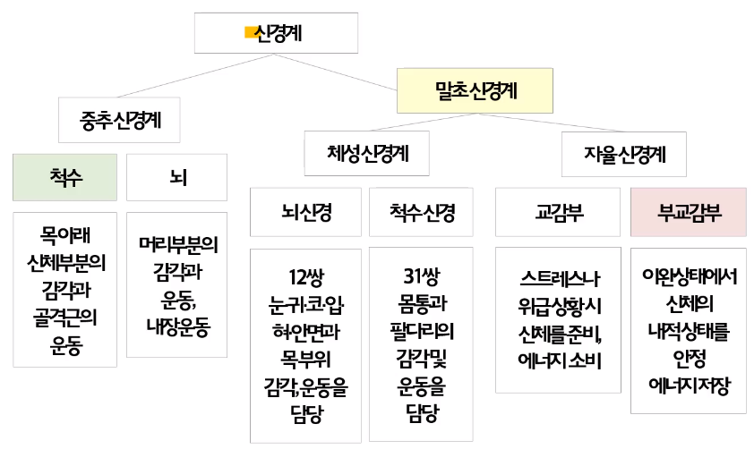

### 말초신경계
12쌍의 뇌신경
31쌍의 척수신경

자율신경계는 교감신경계와 부교감신경계로 구분

|교감신경계|부교감신경계|
|:--:|:--:|
|에너지를 **소모**하는 작용|에너지를 **유지 · 생산**하는 작용|
|동공 확장, 심작 박동 빨라짐, 침이 마름(소화 저하)|타액 분비 증가, 심장 박동 느려짐, 위 활동 촉진(소화력 증가)|

### 척수
#### 중심부
뇌에서 내려오는 운동출력이 척수의 운동뉴련과 연결

#### 주변부
척수로 입력된 감각정보가 뇌로 보내지는 **상해성(구심성) 신경로**
신경로와 뇌에서 내려오는 운동출력의 통로인 **하행성(원심성) 신경로**

#### 척수 반사 회로
감각입력이 개재뉴런을 거쳐 일부 척수 운동뉴런과 연결되어 운동을 일으킴

### 뇌
#### 뇌간
진화상 가장 먼저 나타난 뇌 부위
연수와 뇌교 및 중뇌로 구성

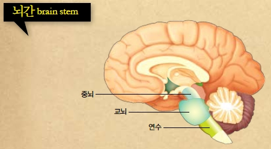
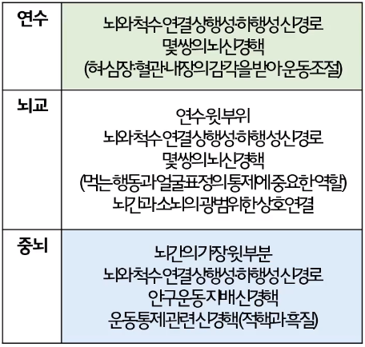

#### 소뇌
근육의 긴장도 조절 · **평형유지** · 학습된 **자동적 운동의 출력** 등 담당
감각과 운동의 협동을 위해 진화과정에서 생겨난 최초의 뇌구조물
> 소뇌가 발달한 사람은 운동신경이 좋음

#### 전뇌: 간뇌, 변연계 및 대뇌피질
##### 간뇌
`시상 Thalamus` : 신체감각 정보를 비롯한 시각 및 청각 정보의 **최종 중계소**
`시상하부 hypothalamus` : 내분비계의 우두머리인 **뇌하수체**에 인접하여 내분비계를 지배하고 **동기 / 정서의 조절** 담당

##### 변연계
간뇌와 대뇌피질을 상호 연결하는 편도체 _amygdala_ · 해마 _hippocampus_ · 중격 _septum_ 등의 뇌핵 포함
- 주로 동기와 정서를 담당

학습과 기억과정에서 보상이나 처벌의 효과를 매개

`파충류의 뇌` : 파충류(악어)의 전뇌는 모두 변연계

##### 대뇌피질
`감각피질`, `운동피질`, `연합피질`

모든 감각 입력을 분석하고 고도의 발달된 정신 기능의 산실
> 인간만이 가지고 있는 부위

###### 좌반구 측두엽
언어에 관련된 기능 국재화

###### 두정엽
감각종합과 공간구성에 관한 기능 국재화

###### 전두엽
운동계획에서 실행기능에 이르는 행동출력의 통제와 조정 기능 국재화
**뇌피질의 팽창 (대)뇌화** _encephalization_

---

## 뉴런의 정보전달 과정
### 뉴런
- **정보전달**이라는 **특수 기능 수행**을 위해 분화된 것
- 출생 직후부터 세포분열이 되지 않음
- 신경계 - 100억개 이상의 뉴런이 상호 연결된 것
- 교 _glia_ 세포들이 뉴런을 도와줌
- 핵을 포함하는 세포체와 복잡한 돌기로 구분

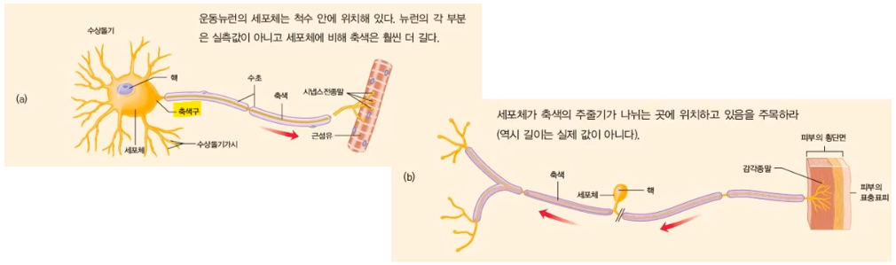

### 뉴런의 구성 요소
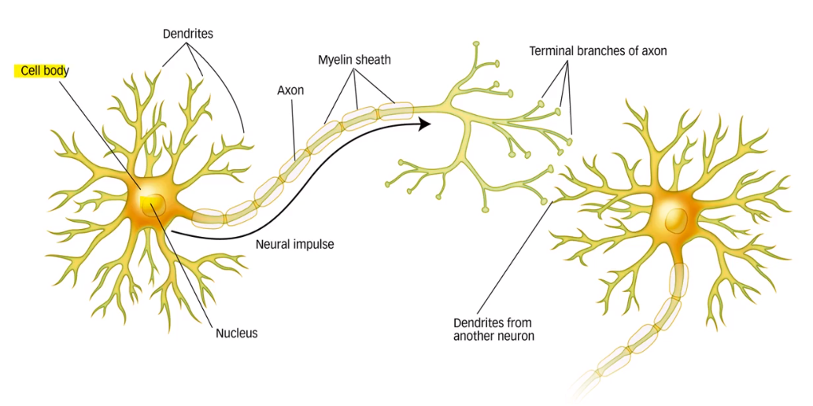

### 뉴런의 종류
`감각뉴런` : 감각 수용기에서 받은 정보를 뇌와 척수로 된 중추신경계로 전달
`운동뉴런` : 뇌나 척수에서 근육과 분비선으로 신경충동을 전달
`개재뉴런` : 감각뉴런과 운동뉴런을 이어주는 뉴런
`신경` : 수 백 or 수 천의 뉴런으로부터 연장된 축색 다발

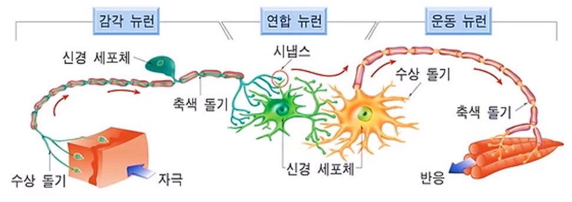

### 활동전위
- 세포막을 경계로 여러 이온의 농도차와 전위차를 바탕으로 하는 **불균형의 안정 상태를 유지(-70mV)**
    > 안정막전위 : -70mV의 전위차

- 뉴런으로 입력되는 **흥분적 신호**와 **억제적 신호**의 **상대적 비율**과 **입력신호의 시간 · 공간적 합산 결과**에 따라 정보 전달 유무를 결정

- 어느 한 시점에서 합산 결과가 **정보전달의 역치**를 넘어서면 **활동전위**라는 전기적 신호가 축색을 따라 축색종말에 전도

- 축색이 굵을수록 전도되는데 걸리는 시간 단축
  - 축색의 **유수축색화**
  > 저항을 최소화하기 위해 피복의 역할을 하는 축색

### 뉴런의 전기적 신호 전달
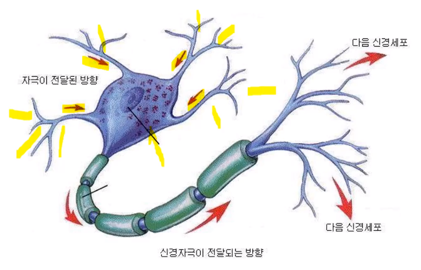

### 활동 전위
1. (흥분성)자극에 의해 축색이 흥분
2. 세포막의 Na+ 이온 투과율이 증가
3. 축색 내부가 외부에 비해 양전위로 변화 → 신경충동 / 흥분

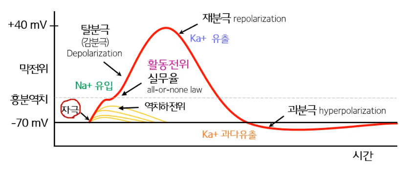

### 이온 이동 채널
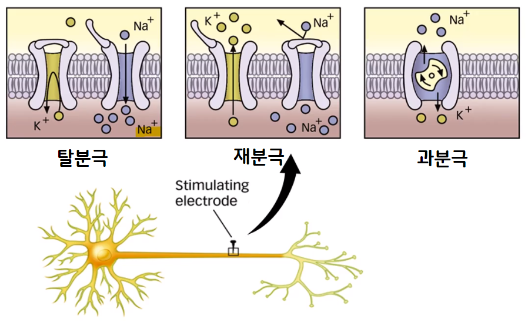

### 축색
- 무수축색/유수축색
- 랑비에 결절 _node of Ranvier_, 도약 전도 

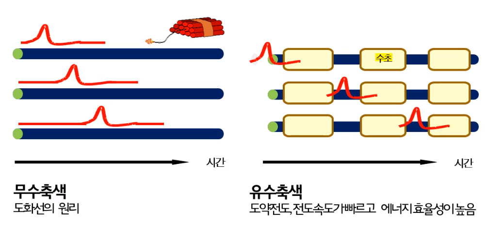

### 시냅스 전달
신경충동 → 축색종말 → 소낭 자극 → 신경전달물질 시냅스 공간 방출 → 신경전달물질 일시적으로 수용기 부착 → 흥분석 or 억제성 시냅스후 전위 발생

## 화학적 시냅스와 시냅스 전달의 유형
### 화학적 시냅스
Otto Loewi의 고전적 실험 (1924)
- 방출된 화학물질이 들어있는 링거액이 다른 개구리의 심박률을 저하시킴
- 시냅스 전달이 **화학적이라는 사실을 증명**

미주신경의 전기자극이 신경과 심장근육간의 시냅스에 `신경전달물질(아세틸콜린)`을 방출
심박률을 저하시키는 작용을 일으킴

### 시냅스 전달의 유형
#### 화학적 시냅스의 작용 유형
`빠른 흥분성 시냅스` : 전달물질이 수용기에 부착되어 (흥분성)정보를 받는 뉴런의 **활동전위 발생 가능성을 증가**시키는 작용 담당

`빠른 억제성 시냅스` : (억제성)정보를 받는 뉴런의 활동전위 **억제 방향으로 작용**
세포체와 축색 최초 분절 근처에 몰려 있는 경향으로 인해 억제 작용이 더 강력하게 나타남

`느린 시냅스 전달` : 시냅스 공간에 방출된 (신경)전달물질의 수용기 부착 과정은 동일
이온통로, 이온펌프, 단백질합성 등의 변화를 유발하여 시냅스후 뉴런의 활동을 조정

## 신경전달물질과 약물의 작용기제
### 신경전달물질
|신경전달물질|뇌회로 또는 존재영역|뇌회로의 주기능|관련 장애|
|:--:|:--:|:--:|:--:|
|아세틸콜린|기저핵 → 해마와 대뇌피질|정상 지적 기능|노인성 치매|
|GABA|대뇌피질과 소뇌피질|억제기능|간질이나 불안신경증(결핍)|
|도파민|흑질 → 기저핵 흑질 옆 → 대뇌피질과 변연계|운동조절, 정상적 사고|파킨슨병(**결핍**), 정신분열증(**과다**)|
|노르에피네프린|청반 → 뇌 전역|행동성 각성|우울증|
|세르토닌|봉선핵 → 뇌 전역|수면과 각성|불면증과 환각|

## 약물의 작용기제
### 혈뇌장벽
뇌혈관 속 유해물질로 인한 재생기능이 없는 뇌조직의 손상을 막아주는 기제
뉴런을 보조하는 세포들이 혈관둘레를 연속적으로 지방질피막으로 감고 있는 것
> 혈액 속의 물질 중 지방 속에 녹지 못하는 것은 혈뇌장벽을 통과할 수 없음

### 신경전달물질 작용 촉진 · 억제 방법
약물이 혈뇌장벽을 통과하여 신경전달물질의 생성 · 방출 · 비활성화 과정에 개입

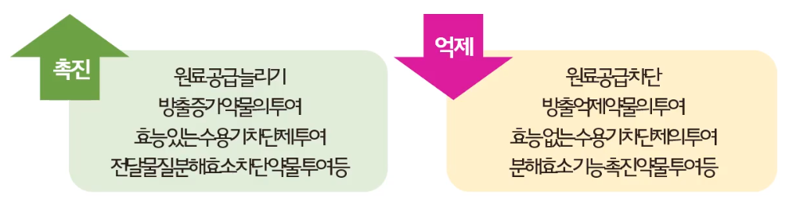

### 아세틸콜린(Ach) 예시
#### 전달 물질 원료 공급
달걀 노른자나 채소같은 음식물을 통해 콜린 섭취 - Ach 합성

#### 시냅스 전 종말에서 Ach 방출 차단
변질 통조림의 독극물인 보툴린(보톡스)

#### Ach 수용기 차단
남미 인디언들이 사냥을 위해 화살촉에 바르는 큐라레

#### Ach 분해 요소 작용 차단
Ach 비활성화로 경련성 마비를 야기
피조스티그민(칼라바르콩), 말라치온(살충제), 신경가스 등...

### 2종류의 Ach 수용기
#### 니코틴성 Ach 수용기
니코틴이 골격근세포 Ach 시냅스에서 Ach처럼 작용

#### 무스카린성 Ach 수용기
무스카린이 심근세포 Ach 시냅스에서 작용

### Ach
골격근세포에서 흥분 작용
심근세포에서는 억제작용(수용기의 특성에 따라)

cf. 큐라레(골격근 세포의 Ach차단), 아트로핀(심근세포의 Ach 수용기 차단)